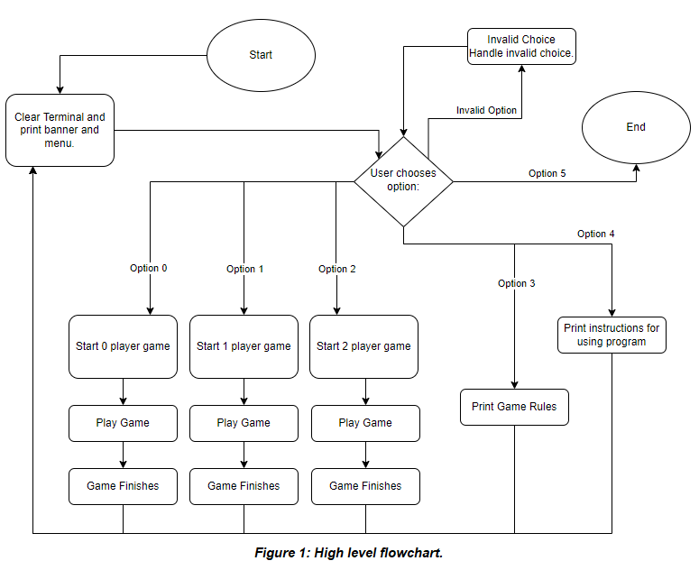
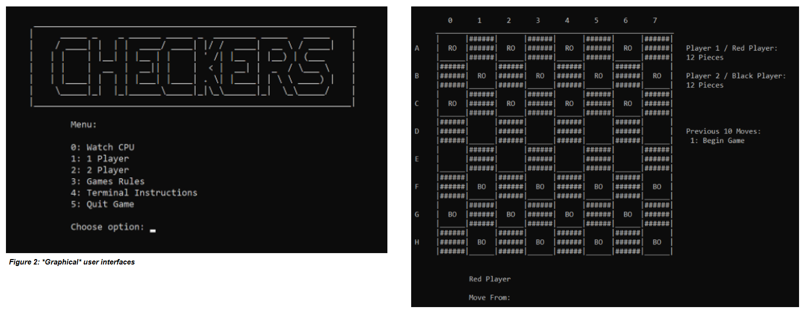
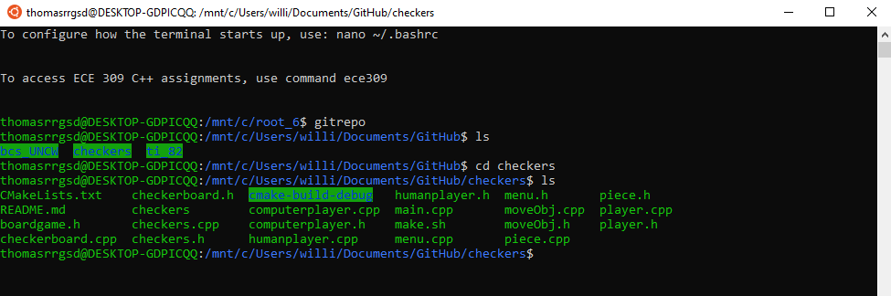
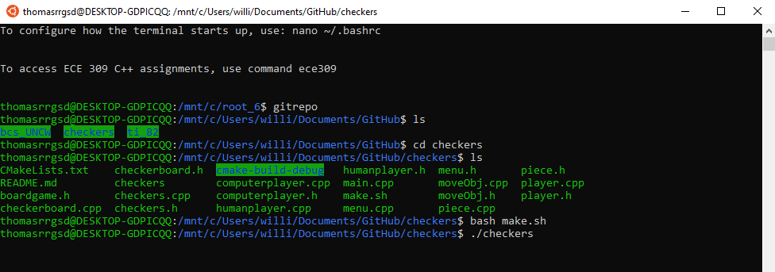

<h1 align="center">ECE 309 Final: Checkers<br/>Team Qubit:<br/>Sam Gaskins, William Jarratt, Nic Quance</h1>

## Table of Contents

* [Game Description](#game-description)
* [Game Dependecies / How to install](#game-dependecies-/-how-to-install)
* [Contributions](#contributions)
* [Useful Links](#useful-links)


## Game Description

The game of checkers involves moving pawns across the board to capture your opponent’s pieces and claim victory. The game is drawn on the terminal window in an ASCII art fashion, and for proper functionality requires a full window size to be present. Without a properly sized window, the game will not draw correctly.

As for the [official checkers rules](https://www.officialgamerules.org/checkers), the game follows the link closely. The game requires the player to take a jump when a jump can be made. The only restriction to these rules is that double jumps cannot be made. This puts a restriction on movement, and so the player must only take into account single jumps only. While excluding double jumps makes analyzing the next move easier, it also takes away an important tactical tool from the user. We were not required to create a GUI, but we added a GUI that utilizes ASCII art and commands that are compatible with Unix terminals.

At the high level, our game follows the flowchart in Figure 1. The user is first presented with a banner and a menu with 5 options. Option 0 chooses to watch a CPU vs CPU game. Option 1 allows for a player to challenge the CPU. Option 2 allows for a player to play against another human player on the same computer. Option 3 displays the rules of checkers. Option 4 gives instructions on how to use the terminal to play the game. Option 5 quits the game and returns the user to the terminal. 



Options 3 and 4 are simply printing text to the terminal and option 5 is quitting the game. Options 0, 1, and 2 engage the game logic and behind the scenes code to play the game of checkers. Depending on which option is chosen a checkers game object is created and is initialized with a specification for the number of players. If 0 players are specified, that is CPU vs CPU. While 1 player and 2 players tells the checkers game object that a human or 2 human players will be involved. Once the object is created its  PlayGame() member function begins the game. When the game is over the user is brought back to the menu where they can choose another option or quit the game. The game logic and code is described further below along with the requirements met (S1-S5).
 
The requirement S1 wants us to represent the game logic and game state in code. The fact that the game runs and plays within the official checkers rules shows that the game logic and state is correctly implemented. The game logic consists of the actual game rules and the flow of the gameplay, and also the logic that goes into choosing the next move.
 
The gameplay logic is a round-robin while loop inside of the checkers object PlayGame() member function. For the game to work, first the game must be set up: place the board down, place the 24 pieces on the board, and have two players sit down at the board. When the checkers object is created, the board, pieces, and players are set up. Then player 1 chooses a move and changes the board in accordance with the rules. Then player 2 does the same thing. This continues until no pieces are left on the board, or one player does have any moves, or no players have a move.
 
The PlayGame() function does this. Between each move it checks if the game is over by running IsThereNoMove() and after every two moves, CheckGameOver(). When a player loses all of its pieces there are no moves, so IsThereNoMove() will catch when a player loses all of its pieces. Also before a move, all valid moves available are calculated with the checkerboard object member function updateValidMoves(). It then calls handlePlayer() to get the input, and human players are prompted to input a move. The handlePlayer() function will prompt the player until a proper move is given. The computer player crawls the valid list of moves and chooses one. HandleCurrentMove() is then called and determines if the move made is just a transition, or if it requires a piece to be jumped and removed, or a piece kinged. HandleCurrentMove() updates the pieces and then updates the board GUI. After each move, the move is added to a list of the previous 10 moves and printed onto the GUI. This happens for each player turn until IsThereNoMove() or CheckGameOver() breaks the loop. The winner of the game is then printed.
 
The game state can also be found in the code. At any moment, there is a checkerboard, up to 12 pieces for each player, two players, a set of possible moves that can be made, and a set of moves that has been made. The checkerboard object has an 8 by 8 array that holds a pointer to a piece. We can see which pieces are in which space. Each piece object tells us the color, position, king status of the piece, and all available moves for the piece. The moves are moveObj objects that tell us: where the move is to, if a jump is made, if a king is made, and which piece to jump if jumping. The list<string> prevMoves tells us the last 10 moves made. Finally, the computerplayer and humanplayer objects tell us if a player is human or CPU.
 
All of these objects come together to make the checkers object, which gives the whole snapshot of the checkers game state. The checkers object contains a checkerboard object, two player objects, 2 sets of 12 piece objects, and a prevMoves list object.
 
The S2 requirement was to provide an interface for a human user to be able to play another human user. This was to be implemented through a player object. We achieved this with a humanplayer class that was derived from the player abstract base class. Checkers requires exactly two players. When we want to facilitate human player versus human player, we simply create two human player objects that are both asked to make moves. When the game is being played, the handlePlayer() member function prompts the player to input a move, which is picking a piece and picking where to move the piece to. The game then handles that input from the human player. Each human player is alternatingly prompted until the game is over.

The S3 requirement was to implement at least one computer player, albeit, a not so very smart computer player. Additionally, it was required that the computer players could play with each other without human interaction. We implemented this feature by the computerplayer class, also derived from the player abstract base class. When a checkers game is being played, the computerplayer object handlePlayer() member function operates differently. Instead of prompting the user for input, the computer player algorithm starts and automatically chooses a move. The move is always the last move in its valid move list. The computerplayer object then feeds that move to the checkers game which processes the move and updates the game board.
 
If we want only computer players, then both player 1 and player 2 are computerplayer objects. Each player object is prompted back and forth, but the user is not prompted, the computerplayer object handlePlayer() member function is responsible for selecting the moves. The computer players will continue making moves back and forth until the conditions for the game to end are met. The algorithm for CPU selecting moves is built in a way that CPU vs CPU will always choose the same set of moves and the game will always end the same.

Is ASCII art considered a GUI? Who knows, but ours transcends text and so we call it graphical. 



The S4 requirement was to provide a means of “watching” the game being played and reporting a winner. The game is “watched” by the GUI on the right in Figure 2. The user can watch and interact with the game in real time. When the game ends, the screen is cleared and ASCII art is printed on the screen that indicates the winner, or if the game ends up being a stalemate.

The last requirement, S5, was to provide a way for the user (a human) to challenge the computer player. The implementation of this feature is very similar to the implementation of human vs human and computer vs computer. When the checkers object is created, a humanplayer and computerplayer object is created. Player 1 (red) is always the human player. The game alternates running handlePlayer() for each object. The human player is prompted to input a move, while the computer automatically chooses its own move.
       
## Game Dependecies / How to install

This game was designed to run on linux. The GUI uses commands that are specific to the unix terminal. This class makes use of the standard template library, which should already exist on most systems. In addition to the the STL, this project also utilizes the chrono and thread library. Make sure that those are installed in your linux build. Additionally, g++ is required to compile the code. This code was compiled and tested with WSL Ubuntu 18 and 20 using g++-7, g++-9, and g++-11. Earlier versions of g++ and different unix builds may work but have not been tested.

To run the game, follow these steps:
1. Download the GitHub repository and place the files into a root director. In this example the root folder will be called "checkers".
2. Open your unix terminal and navigate to the the folder just created. 
3. Compile the game by running this command ```bash make.sh```.
5. Once the game compiles, with no errors, you can run the game by typing ```./checkers```, inside the root folder. Note: The terminal window must be larger than the area taken up by the ASCII text. If the terminal window is too small the GUI will mess up and you will need to restart the game. 
7. Play the game!

## Contributions

- Sam Gaskins
  - Wrote classes: 
    -	player, 
    -	humanplayer, 
    -	computerplayer
  -	Worked on/Reviewed classes:
    -	checkerboard, 
    -	checkers, 
    -	menu
- William Jarratt
  - Wrote classes: 
    - checkers, 
    -	checkerboard, 
    -	menu, 
    -	boardgame
  -	Worked on/Reviewed classes: 
    -	piece, 
    -	moveObj, 
    -	human player
- Nic Quance
  -	Wrote classes: 
    -	piece, 
    -	moveObj
  -	Worked on/Reviewed classes: 
    -	player, 
    -	computerplayer,
    -	humanplayer,
    -	checkerboard, 
    -	checkers, 
    -	menu

## Useful Links

- [Google Drive](https://drive.google.com/drive/folders/1zW02CWV1u2DdPsW9kTiVI3xiLsa1HeG5?usp=sharing)
- [Video Presentation](https://youtu.be/yY7mE7bq4Lo)
